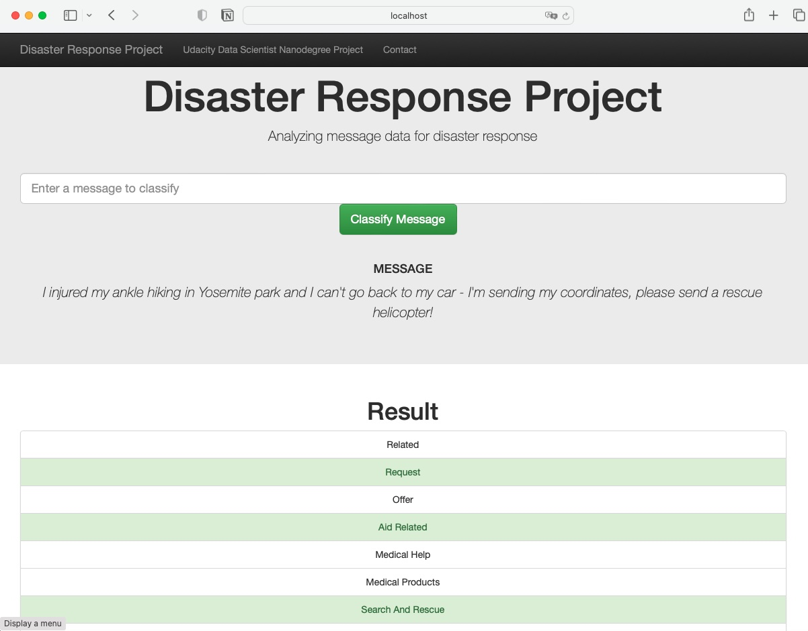

# Disaster Response Pipeline

This repository contains a Machine Learning (ML) pipeline which predicts message categories in disaster situations. It is precisely during disaster situations, that the response organizations have the least capacity to evaluate and react properly to each message that arrives to them (via direct contact, social media, etc.). In this project, NLP is applied and a classification model is trained so that the category of each message can be predicted automatically; then, the messages can be directed to the appropriate relief agencies. In total 36 message categories are predicted, which are related to the type of possible emergency, e.g., `earthquake`, `fire`, `missing_people`, etc.

All in all, the following methods/techniques are implemented and documented:

- [x] An ETL pipeline (Extract, Transform, Load).
- [x] A Machine Learning pipeline which applies NLP to messages and predicts message categories.
- [x] Testing (Pytest) and linting.
- [x] Error checks, data validation with Pydantic and exception handling.
- [x] Logging.
- [x] Continuous Integration with Github Actions.
- [x] Python packaging.
- [x] Containerization (Docker).
- [x] Flask web app, deployed locally.

The Flask web app enables interaction, i.e., the user inputs a text message and the trained classifier predicts candidate categories:

<p style="text-align:center">
  
</p>

I took the [`starter`](starter) code for this project from the [Udacity Data Scientist Nanodegree](https://www.udacity.com/course/data-scientist-nanodegree--nd025) and modified it to the present form, which deviates significantly from the original version.

## Table of Contents

- [Disaster Response Pipeline](#disaster-response-pipeline)
  - [Table of Contents](#table-of-contents)
  - [How to Use This Project](#how-to-use-this-project)
    - [Installing Dependencies for Custom Environments](#installing-dependencies-for-custom-environments)
  - [Dataset](#dataset)
  - [Notes on the Implementation](#notes-on-the-implementation)
    - [The `disaster_response` Package](#the-disaster_response-package)
      - [ETL Pipeline](#etl-pipeline)
      - [Machine Learning Training Pipeline](#machine-learning-training-pipeline)
        - [Notes on the Model Evaluation](#notes-on-the-model-evaluation)
    - [Flask Web App](#flask-web-app)
    - [Tests](#tests)
    - [Continuous Integration with Github Actions](#continuous-integration-with-github-actions)
    - [Docker Container](#docker-container)
  - [Next Steps, Improvements](#next-steps-improvements)
  - [References and Links](#references-and-links)
  - [Authorship](#authorship)

## How to Use This Project

The directory of the project consists of the following files:

```
.
├── Instructions.md                             # Original challenge/project instructions
├── README.md                                   # This file
├── app                                         # Web app
│   ├── run.py                                  # Implementation of the Flask app
│   └── templates                               # Web app HTML/CSS templates
│       ├── go.html
│       └── master.html
├── assets/                                     # Images, etc.
├── data                                        # Datasets
│   ├── DisasterResponse.db                     # Generated database
│   ├── categories.csv                          # Catagories dataset
│   └── messages.csv                            # Messages dataset
├── disaster_response                           # Package
│   ├── __init__.py
│   ├── file_manager.py                         # General structures, loading/persistence manager
│   ├── process_data.py                         # ETL pipeline
│   └── train_classifier.py                     # ML pipeline and training
├── main.py                                     # Script which runs both pipelines: ETL and ML (training)
├── models                                      # Inference and evaluation artifacts
│   ├── classifier.pkl                          # Trained pipeline (not committed)
│   └── evaluation_report.txt                   # Evaluation metrics: F1, etc.
├── disaster_response_pipeline.log              # Logs
├── notebooks                                   # Research notebooks
│   ├── ETL_Pipeline_Preparation.ipynb
│   └── ML_Pipeline_Preparation.ipynb
├── config.yaml                                 # Configuration file
├── conda.yaml                                  # Conda environment
├── requirements.txt                            # Dependencies for pip
├── Dockerfile                                  # Docker image definition
├── docker-compose.yaml                         # Docker compose YAML
├── run.sh                                      # Execution script for Docker
├── setup.py                                    # Package setup
├── starter/                                    # Original starter material
└── tests                                       # Tests
    ├── __init__.py
    ├── conftest.py                             # Pytest configuration, fixtures, etc.
    └── test_library.py                         # disaster_response package tests
```

To run the pipelines and the web app, first the dependencies need to be installed, as explained in the [next section](#installing-dependencies-for-custom-environments). Then, we can execute the following commands:

```bash
# This runs the the ETL pipeline, which creates the DisasterResponse.db database
# It also runs the ML pipeline, which trains the models and outputs classifier.pkl
# WARNING: The training might take some hours, because hyperparameter search
# with cross-validation is performed.
python main.py

# Spin up the web app
# Wait 10 seconds and open http://localhost:3000
# We see some visualizations there; if we enter a message,
# we should get the predicted categories.
python app/run.py
```

Notes: 

- [`main.py`](./../main.py) uses [`config.yaml`](`./../config.yaml`); that configuration file defines all necessary parameters for both pipelines (ETL and ML training). However, some parameters can be overridden via CLi arguments &mdash; try `python main.py --help` for more information.
- :warning: The training might take some hours, because hyperparameter search with cross-validation is performed.
- The outputs from executing both pipelines are the following:
  - `DisasterResponse.db`: cleaned and merged SQLite database, product of the ETL process.
  - `classifier.pkl`: trained classifier, used by the web app.
  - `evaluation_report.txt`: evaluation metrics of the trained classifier.

### Installing Dependencies for Custom Environments

You can create an environment with [conda](https://docs.conda.io/en/latest/) and install the dependencies with the following recipe:

```bash
# Create environment with YAML, incl. packages
conda env create -f conda.yaml
conda activate dis-res
pip install . # install the disaster_response package

# Alternatively, if you prefer, create your own environment
# and install the dependencies with pip
conda create --name dis-res pip
conda activate dis-res
pip install -r requirements.txt
pip install . # install the disaster_response package
```

Note that both [`conda.yaml`](./conda.yaml) and [`requirements.txt`](./requirements.txt) contain the same packages; however, [`requirements.txt`](./requirements.txt) has the specific package versions I have used with Python `3.9.16`.

## Dataset

The dataset is contained in the folder [`data`](data), and it consists of the following files:

- `messages.csv`: a CSV of shape `(26248, 4)`, which contains the help messages (in original and translated form) as well as information on the source.
- `categories.csv`: a CSV of shape `(26248, 2)` which matches each message id from `messages.csv` with 36 categories, related to the type of disaster message. All categories are in text from in one column. All those target categories are listed in [`config.yaml`](config.yaml).

The [`notebooks`](notebooks) provide a good first exposure to the contents of the datasets. After running the [ETL pipeline](#etl-pipeline), the SQLite database `DisasterResponse.db` is created, which contains a clean merge of the aforementioned files.

## Notes on the Implementation

In the following subsections, information on different aspects of the implementation is provided.

### The `disaster_response` Package

The Machine Learning (ML) functionalities are implemented in this package, which can be used as shown in [`main.py`](./main.py). The package consists of the following files:

- [`file_manager.py`](./distaster_response/file_manager.py): loading, validation and persistence manager.
- [`process_data.py`](./distaster_response/process_data.py): ETL pipeline.
- [`train_classifier.py`](./distaster_response/train_classifier.py): ML/training pipeline.

Having a file loading/validation/persistence manager makes the other modules more clear, abstracts the access to 3rd party modules and improves maintainability.

#### ETL Pipeline

The ETL (Extract, Transform, Load) pipeline implemented in [`process_data.py`](./distaster_response/process_data.py) performs the following tasks:

- Load the source CSV datasets from [`data`](data).
- Clean and merge the datasets:
  - Transform categories into booleans.
  - Check that category values are correct.
  - Drop duplicates and NaNs.
- Save the processed dataset into a SQLite database to `DisasterResponse.db` (or the filename defined in `config.yaml`).

We can interact using SQL with the SQLite database `DisasterResponse.db` produced by the ETL pipeline via CLI if we install [`sqlite3`](https://www.tutorialspoint.com/sqlite/sqlite_installation.htm):

```bash
cd data
# Enter SQLite terminal
sqlite3
# Open a DB
.open DisasterResponse.db
# Show tables
.tables # Message
# Get table info/columns & types
PRAGMA table_info(Message);
# Get first 5 entries
SELECT * FROM Message LIMIT 5;
# ...
# Exit SQLite CLI terminal
.quit
```

For more information on how to interact with relational/SQL databases using python visit my [sql_guide](https://github.com/mxagar/sql_guide).

#### Machine Learning Training Pipeline

[`distaster_response/train_classifier.py`](./distaster_response/train_classifier.py)

[`models`](models)

##### Notes on the Model Evaluation

Imbalanced dataset.

### Flask Web App

[`app/run.py`](./app/run.py)

### Tests

Once we have [Pytest](https://docs.pytest.org/en/7.2.x/) installed, we can run the tests as follows:

```bash
pytest tests
```

The [`tests`](./tests) folder contains these two files:

- [`tests/conftest.py`](./tests/conftest.py): configuration and fixtures definition.
- [`tests/test_library.py`](./tests/test_library.py): tests of functions defined in the `disaster_response` package.

:construction: Currently, very few and shallow tests are implemented; even though the loading/persistence module [`file_manager.py`](./disaster_response/file_manager.py) validates many objects with [pydantic](https://docs.pydantic.dev/) and error-detection checks, the tests should be extended.

### Continuous Integration with Github Actions

I have implemented Continuous Integration (CI) using Github Actions. The workflow file [`python-app.yml`](.github/workflows/python-app.yml) performs the following tasks every time we push changes to the `main` branch:

- Requirements are installed.
- `flake8` is run to lint the code; note that [`.flake8`](.flake8) contains the files/folders to be ignored.
- Tests are run as explained above: `pytest tests`.

### Docker Container

Containerization is a common step before deploying/shipping an application. Thanks to the simple [`Dockerfile`](./Dockerfile) in the repository, we can create an image of the web app and run it as a container as follows:

```bash
# Build the Dockerfile to create the image
# docker build -t <image_name[:version]> <path/to/Dockerfile>
docker build -t disaster_response_app:latest .
 
# Check the image is there: watch the size (e.g., ~1GB)
docker image ls

# Run the container locally from a built image
# Recall to: forward ports (-p) and pass PORT env variable (-e), because run.sh expects it!
# Optional: 
# -d to detach/get the shell back,
# --name if we want to choose conatiner name (else, one randomly chosen)
# --rm: automatically remove container after finishing (irrelevant in our case, but...)
docker run -d --rm -p 3000:3000 -e PORT=3000 --name disaster_response_app disaster_response_app:latest

# Check the API locally: open the browser
#   WAIT 30 seconds...
#   http://localhost:3000
#   Use the web app
 
# Check the running containers: check the name/id of our container,
# e.g., census_model_app
docker container ls
docker ps

# Get a terminal into the container: in general, BAD practice
# docker exec -it <id|name> sh
docker exec -it disaster_response_app sh
# (we get inside)
cd /opt/disaster_response_pipeline
ls
cat disaster_response_pipeline.log
exit

# Stop container and remove it (erase all files in it, etc.)
# docker stop <id/name>
# docker rm <id/name>
docker stop disaster_response_app
docker rm disaster_response_app
```

Alternatively, I have written a [`docker-compose.yaml`](./docker-compose.yaml) YAML which spins up the one-container service with the required parameters:

```bash
# Run contaner(s), detached; local docker-compose.yaml is used
docker-compose up -d

# Check containers, logs
docker-compose ps
docker-compose logs

# Stop containers
docker-compose down
```

Note: in order to keep image size in line, [`.dockerignore`](.dockerignore) lists all files that can be avoided, similarly as `.gitignore`.

## Next Steps, Improvements

- [x] Add logging.
- [x] Lint with `flake8` and `pylint`.
- [ ] Deploy it, e.g., to Heroku or AWS; another example project in which I have deployed the app that way: [census_model_deployment_fastapi](https://github.com/mxagar/census_model_deployment_fastapi).
- [ ] Extend tests; currently, the test package contains very few tests that serve as blueprint for further implementations.
- [ ] Add type hints to `process_data.py` and `train_classifier.py`; currently type hints and `pydantic` are used only in `file_manager.py` to clearly define loading and persistence functionalities and to validate the objects they handle.
- [ ] Optimize properly the machine learning model: try with alternative models, perform a through hyperparameter tuning (e.g., with [Optuna](https://optuna.org)), etc.
- [ ] Address the imbalanced nature of the dataset.
- [ ] Add more visualizations to the web app.
- [ ] Based on the detected categories, suggest organizations to connect to.
- [ ] Improve the front-end design.

## References and Links

- A
- B
- C
- Link
- Link

## Authorship

Mikel Sagardia, 2022.  
No guarantees.

If you find this repository useful, you're free to use it, but please link back to the original source.